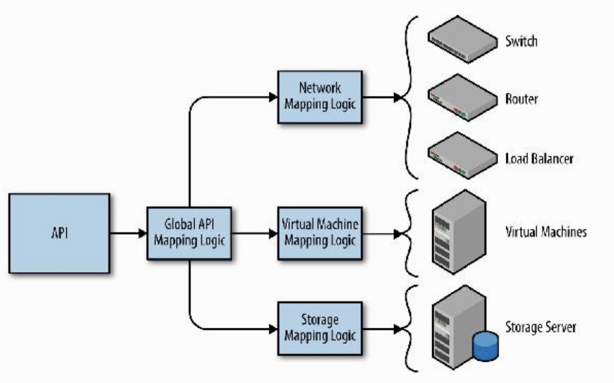

# 第4章 设计基础架构应用程序

在前一章中，我们了解了基础架构的各种表示以及围绕其部署工具的各种方法。在本章中，我们将看看如何设计部署和管理基础架构的应用程序。在上一章中我们重点关注基础架构即软件的开放世界，有时称为基础架构即应用。

在云原生环境中，传统的基础架构运维人员需要转变为基础架构软件工程师。与过去的其他运维角色不同，这仍然是一种新兴的做法。我们迫切需要开始探索这种模式和制定标准。

基础架构即软件与基础架构即代码之间的根本区别在于，软件会持续运行，并会根据调节器模式创建或改变基础架构，我们将在本章后面对其进行解释。此外，基础架构即软件的新范例是，软件现在与数据存储具有更传统的关系，并公开用于定义所需状态的API。例如，该软件可能会根据数据存储中的需要改变基础架构的表示形式，并且可以很好地管理数据存储本身！希望进行协调的状态更改通过API发送到软件，而不是通过运行静态代码库中的程序。

迈向基础架构即软件的第一步是让基础架构的运维人员意识到自己是软件工程师。我们热烈欢迎您来到这个领域！先前的工具（例如配置管理）也有类似的改变基础架构运维人员的工作职能的目标，但是运维人员通常只会在狭窄的应用范围内编写有限的DSL（即单一节点抽象）。

作为一名基础架构工程师，您的任务不仅是掌握设计、管理和运维基础架构的基本原则，还需要具有将您的专业知识封装成坚如磐石的应用程序的能力。这些应用程序代表了我们将要管理和改变的基础架构。

构建管理基础架构软件工程不是一件容易的事情。我们有管理传统应用的所有问题和担忧，而且我们正处于一个尴尬的境地。基础架构软件工程看上去似乎很荒谬，构建软件来部署基础架构，这样就可以在新创建的基础架构之上运行相同的软件，这很尴尬。

首先，我们需要了解这个新领域中工程软件的细微差别。我们将研究在云原生社区中得到验证的模式，以了解在应用程序中编写干净和逻辑代码的重要性。但首先，基础架构从哪里来？

## 自举问题

1987年3月22日，周日，Richard M. Stallman发送了一封电子邮件到GCC邮件列表，报告成功使用C编译器完成了自行编译：

> 该编译器在68020上编译正确，最近又在vax上进行了编译。最近在68020上正确编译了Emacs，并且还编译了tex-in-C和Kyoto Common Lisp。但是，可能仍然有许多错误，希望你能帮我找到。
>
> 我将离开一个月，所以现在报告的错误将得不到处理。——Richard M. Stallman

这是软件历史上的一个重要转折点，因为工程软件首次完成了自举（Bootstrap）。Stallman开创了一个可以自行编译的编译器。即使在哲学上接受这个表述可能也是困难的。

今天我们正在解决与基础架构相同的问题。工程师必须想办法解决几乎不可能的系统自举问题，并在运行时生效。

有一种方法是手动创建云计算和基础架构应用程序中的第一个基础架构。尽管这种方法确实有效，但它通常伴随着警告，即运维人员应该在部署更合适的基础架构后销毁初始引导基础架构。这种方法乏味、难以重复且容易出现人为错误。

解决这个问题的更优雅和云原生方法是做出（通常是正确的）假设，即试图引导基础架构软件的任何人都有本地机器，我们可以利用这个本地机器。现有机器（您的计算机）可作为第一个部署工具，自动在云中创建基础架构。基础架构就位后，您的本地部署工具可以将其自身部署到新创建的基础架构并持续运行。良好的部署工具可以让你在完成后轻松清理。

在初始基础架构引导问题解决后，我们可以使用基础架构应用程序来引导新的基础架构。现在本地计算机已经被排除在外，现在我们完全运行在云端。

## API

在前面的章节中，我们讨论了表示基础架构的各种方法。在本章中，我们将探讨为基础架构提供API的概念。

当用软件实现API时，很可能会通过数据结构来完成。因此，根据您使用的编程语言，将API视为类、字典、数组、对象或结构体是安全的。

API将是数据值的任意定义，可能是字符串、整数或布尔值。API将通过JSON或YAML格式进行编码和解码甚至可能存储在数据库中。

对于大多数软件工程师来说，为程序提供可版本化的API是很常见的做法。这允许程序随着时间移动、改变和增长。工程师可以声称支持较旧的API版本并提供向后兼容性保证。在基础架构即软件中，由于这些原因，使用API是首选的。

寻找一个API作为基础架构的接口是用户使用基础架构即软件的许多线索之一。传统上，基础架构即代码是用户将要管理的基础架构的直接表示，而API是对要管理的具体底层资源之上的抽象。

最终，API只是代表基础架构的数据结构。

## 状态

在基础架构即软件工具的环境中，我们要管理的对象是基础架构。因此，对象状态只是我们的程序对软件的审计表示。

对象的状态最终将回到基础架构表示的内存中。这些内存中的表示应映射到用于声明基础架构的原始API。审计的API或对象状态通常需要保存。

存储介质（有时称为状态存储）可用于存储新审计的API。介质可以是任何传统存储系统，例如本地文件系统、云对象存储或数据库。如果数据存储在类似文件系统的存储中，那么该工具将很可能以逻辑方式对数据进行编码，以便可以在运行时轻松对数据进行编码和解码。常见的编码包括JSON、YAML和TOML。

当设计程序时您可能会想要将用于存储其他数据的特权信息存储起来。这究竟是不是最佳实践具体取决于您的安全性要求以及您计划存储数据的位置。

记住存储机密可能是一个漏洞，这一点很重要。在设计软件来控制堆栈最基本的部分时，安全性至关重要。所以通常值得额外的努力来确保机密信息是安全的。

除了存储有关程序和云提供商凭证的元信息之外，工程师还需要存储有关基础架构的信息。重要的是要记住，基础架构将以某种方式呈现，理想情况下，该程序易于解码。记住对系统进行更改不会立即发生，而随着时间的推移也很重要。

存储这些数据并能够轻松访问是设计基础架构管理应用程序的重要部分。仅基础架构定义很可能就已经是系统中最具智慧价值的部分。我们来看一个基本的例子，看看这些数据和程序如何一起工作。

重新审视例4-1至4-4，因为它们被用作本章进一步演示的具体例子。

**文件系统状态存储示例**

想象一下，数据存储在一个名为state的目录中。在该目录中，有三个文件：

 -  meta_information.yaml
 -  secrets.yaml
 -  infrastructure.yaml

这个简单的数据存储可以准确地封装需要保留的信息，以便有效管理基础架构。

`secrets.yaml`和`infrastructure.yaml`文件存储基础架构的表示形式，`meta_information.yaml`文件（示例4-1）存储其他重要信息，例如基础架构上次调配时间，调配时间和日志信息。

例4-1. state/meta_information.yaml

```yaml
lastExecution:
  exitCode: 0
  timestamp: 2017-08-01 15:32:11 +00:00
  user: kris
  logFile: /var/log/infra.log
```

第二个文件`secrets.yaml`保存私人信息，用于在程序执行过程中以任意方式验证（例4-2）。

重申一下，以这种方式存储机密可能是不安全的。我们仅以`secrets.yaml`为例。

例4-2. state/secrets.yaml

```yaml
apiAccessToken: a8233fc28d09a9c27b2e2f
apiSecret: 8a2976744f239eaa9287f83b23309023d
privateKeyPath: ~/.ssh/id_rsa
```

第三个文件`infrastructure.yaml`将包含API的编码表示形式，包括使用的API版本（示例4-3）。我们可以在这里找到基础架构表示，例如网络和DNS信息，防火墙规则和虚拟机定义。

例4-3. state/infrastructure.yaml

```yaml
location: "San Francisco 2"
name: infra1
dns:
    fqdn: infra.example.com
network:
  cidr: 10.0.0.0/12
  serverPools:
  - bootstrapScript: /opt/infra/bootstrap.sh
    diskSize: large
    workload: medium
    memory: medium
    subnetHostsCount: 256
    firewalls:
      - rules:
          - ingressFromPort: 22
            ingressProtocol: tcp
            ingressSource: 0.0.0.0/0
            ingressToPort: 22
    image: ubuntu-16-04-x64
```

起初`infrastructure.yaml`文件可能看起来只不过是基础架构代码的一个例子。但是，如果仔细观察，您会发现许多定义的指令都是具体基础架构之上的抽象。例如，`subnetHostsCount`指令是一个整数值并定义了子网中主机的预定数量。该程序将设法为运维人员划分网络中定义的更大的无类别域间路由（CIDR）值。运维人员不会声明子网，只需要声明有多少主机。软件会帮运维人员完成剩下的操作。

程序运行时可能会更新API并将新的表示写入数据存储区（本案例中仅是一个文件）。继续我们的`subnetHostsCount`示例，假设程序确实为我们挑选了一个子网CIDR。新的数据结构可能如例4-4所示。

```yaml
location: "San Francisco 2"
name: infra1
dns:
    fqdn: infra.example.com
network:
  cidr: 10.0.0.0/12
serverPools:
  - bootstrapScript: /opt/infra/bootstrap.sh
    diskSize: large
    workload: medium
    memory: medium
    subnetHostsCount: 256
    assignedSubnetCIDR: 10.0.100.0/24
    firewalls:
      - rules:
          - ingressFromPort: 22
            ingressProtocol: tcp
            ingressSource: 0.0.0.0/0
            ingressToPort: 22
    image: ubuntu-16-04-x64
```

请注意程序如何编写assignedSubnetCIDR指令，而不是由运维人员操作。另外，请记住应用程序如何更新API是用户以软件方式与基础架构进行交互的标志。

现在，请记住，这只是一个例子，并不一定主张使用抽象计算子网CIDR。不同的用例可能需要在应用程序中进行不同的抽象和实现。关于构建基础架构应用程序的一个好处是，用户可以以任何他们认为可以解决自己问题的方式设计软件。

数据存储（`infrastructure.yaml`文件）现在可以被认为是软件工程领域的传统数据存储。也就是说，该程序可以对文件进行完全的写入控制。

我们会发现，这会带来风险，但对工程师来说也是一个巨大的胜利。基础架构表示不必存储在文件系统的文件中。相反，它可以存储在任何数据存储中，如传统数据库或键/值存储系统。

为了理解软件如何处理这种新的基础架构表示的复杂性，我们必须理解系统中的两种状态——API形式的预期状态，可在`infrastructure.yaml`文件中找到，另一种可以在现实（或审计）中观察到的实际状态。

在这个例子中，软件还没有做任何事情或者采取任何行动，而我们正处于管理时间线的开始。因此，实际状态将是什么都没有，而预期状态将是封装在`infrastructure.yaml`文件中的任何状态。

## 调节器模式

调节器模式（reconciler pattern）是一种软件模式，可用于管理云原生基础架构。该模式强化了基础架构的两种表现形式——第一种是基础架构的实际状态，第二种是基础架构的预期状态。

调节器模式将迫使工程师以两个独立的途径忘记这些表示，以及实现一个解决方案，以协调实际状态达到预期状态。

调节器模式可以被认为是一套四种方法和四种哲学规则：

1. 所有的输入和输出都使用数据结构。
1. 确保数据结构是不可变的。
1. 保持资源映射简单。
1. 使实际状态符合预期状态。

这些模式的消费者可以依靠这些强大的保证。此外，他们将消费者从实施细节中解放出来。

### 规则1：为所有输入和输出使用数据结构

实现调节器模式的方法只能接受和返回数据结构。结构必须在调节器实现的上下文之外定义，但实现必须知道它。

通过仅接受用于输入的数据结构并将其作为输出返回，消费者可以协调其数据存储中定义的任何结构，而不必担心该协调如何发生。这也允许在运行时或者程序的不同版本中改变、修改或切换实现。

尽管我们希望尽可能经常遵守第一条规则，但是永远不要将数据结构和代码库紧密结合也非常重要。始终遵守最佳的抽象和分离实践，绝不使用API的子集来传递函数或类。

### 规则2：确保数据结构不可变

考虑像合同或担保这样的数据结构。在调节器模式的上下文中，实际和期望的结构在运行时设置在内存中。这保证了在调节之前结构是准确的。在协调基础架构的过程中，如果结构发生变化，则必须创建一个具有相同保证的新结构。明智的基础架构应用程序将强制数据结构的不变性，即使工程师试图改变数据结构，它也不会工作，或者程序会出错（甚至可能会编译不过）。

基础架构应用程序的核心组件是将表示映射到一组资源的能力。资源是需要运行以满足基础架构要求的单个任务。这些任务中的每一个都将负责以某种方式更改基础架构。

部署新虚拟机是基本示例，设置新网络或配置现有虚拟机。这些工作单元中的每一个都将被称为资源。每个数据结构都应映射到一定数量的资源。应用程序负责推理结构并创建资源集。图4-1中显示了API映射到单个资源的示例。



图4-1. 将结构映射到资源的图表

调节器模式演示了一种处理数据结构的稳定方法，因为它会改变资源。由于调节器模式需要比较资源状态，所以数据结构必须是不可变的。这意味着无论何时需要更新数据结构，都必须创建新的数据结构。

注意基础架构的变化。每次发生突变时，实际的数据结构都是陈旧的。一个聪明的基础架构应用程序将意识到这个问题并相应地处理它。

一种简单的解决方案是在发生突变时更新内存中的数据结构。如果每次突变都更新实际状态，则可以观察调节过程，因为实际状态会随时间经历一系列更改，直到最终匹配预期状态并且调节完成。

### 规则3：保持资源映射简单

在调节者的幕后，这个模式就是一个实现。一个实现只是一组代码，具有创建、修改和删除基础结构的方法。一个程序可能有很多实现。

每个实现最终都需要将数据结构映射到一组资源。这组资源需要按逻辑方式组合在一起，以便程序可以推断每个资源。

除了创建资源的基本模型之外，您必须非常注意每个资源的依赖关系。许多资源依赖于其他资源，这意味着许多基础架构都依赖于其他部分。例如，在将虚拟机放入网络之前，网络需要存在。

调节器模式规定应该使用用于分组资源的最简单的数据结构。

解决资源映射问题是一个工程决策，每个实现都可能会发生变化。仔细挑选数据结构非常重要，因为从工程角度看，调节器需要稳定且易于理解。

映射数据的两种常见结构是集合和图形。

一组是可以迭代的资源的平面列表。在许多编程语言中，这些被称为列表、集合、数组等。

图形是通过指针链接在一起的顶点（vertex）的集合。根据编程语言，图的顶点通常是结构或类。顶点通过在顶点某处定义的指针有一个到另一个顶点的链接。图形实现可以通过指针从一个跳到另一个来访问每个顶点。

例4-5是Go编程语言中一个基本顶点的例子。

例4-5. 示例顶点

```go
// Vertex是表示图中单点的数据结构。一个Vertex可以有N个子点或一个也没有。
type Vertex struct {
Name string
    Children []*Vertex
}
```

遍历图的例子可能像迭代遍历每个子元素一样简单。这种遍历有时被称为“walking the graph”。

例4-6是通过Go中写入的深度优先遍历递归访问图中每个顶点的示例。

例4-6. 深度优先遍历

```go
// recursiveWalk将递归地挖掘所有子级，并相应地搜索其子级，并将当前正在访问的顶点的名称回显到STDOUT。
func recursiveWalk(v *Vertex){
    fmt.Printf("Currently visiting vertex: %s\n", v.Name) 
    for _, child := range v.Children {
        recursiveWalk(child)
    }
}
```

首先，图的简单实现似乎是解决资源图的合理选择，因为可以通过逻辑方式构建图来处理依赖关系。虽然图会起作用，但它也会带来风险和复杂性。实施图来绘制资源的最大风险是在图中有环。一个循环是当一个图的一个顶点通过一条以上的路径指向另一个顶点时，这意味着遍历该图是一个无止境的操作。

必要时可以使用图，但在大多数情况下，调节器模式应该映射一组资源，而不是图。通过使用一个集合，调节器可以程序化地遍历资源，并提供线性方法来解决映射问题。此外，撤销或删除基础架构的过程与通过反向遍历集合一样简单。

### 规则4：使实际状态符合预期状态

协调器模式中提供的保证是，用户可以准确得到预期的结果或错误。这是使用调节器的工程师可以依赖的保证。这很重要，因为消费者不必担心验证调节人突变是幂等的并且按预期结束。实现最终负责解决此问题。有了这种保证，在更复杂的操作中使用调节器模式，如控制器或operator，现在变得更加简单。

在返回调用代码之前，实现应检查新调节的实际数据结构是否与最初预期的数据结构匹配。如果没有，它应该是错误的。消费者不应该关心验证API，并且应该相信如果出现问题调节器会报错。

因为数据结构是不可变的，并且如果协调器模式不成功，API也会出错，因此我们可以高度信任API。对于复杂的系统，重要的是，您必须相信软件可以以可预测的方式工作或失败。

## 调节器模式的方法

根据我们刚刚解释的调节器模式的信息和规则，让我们看看这些规则是如何实现的。我们将通过查看实现调节器模式的应用程序所需的方法来执行此操作。

调节器模式的第一种方法是`GetActual()`。这种方法有时称为审计，用于查询基础架构的实际状态。该方法通过生成资源映射，然后程序地调用每个资源以查看存在什么（如果有的话）。该方法将根据查询结果更新数据结构，并返回表示实际正在运行的程序状态以填充数据结构。

一个更简单的方法`GetExpected()`将从数据存储中读取对象的预期状态。在`infrastructure.yaml`示例（例4-4）中，`GetExpected()`将简单地解组这个YAML并将其以内存中的数据结构的形式返回。在这一步没有进行资源审计。

最令人兴奋的方法是`Reconcile()`方法，其中调节器实现将获得对象的实际状态和预期状态。

这是调节器模式的意图驱动行为的核心。底层调节器实现将使用在`GetActual()`中使用的相同资源映射逻辑来定义一组资源。然后协调执行将对这些资源进行操作，独立协调每一个资源。

了解每个资源调节步骤的复杂性非常重要。调节器实现必须以两种方式工作。

首先，从所需和实际状态获取资源属性。接下来，将更改应用到最小的一组属性，以使实际状态与所需的状态匹配。

只要这两个基础架构的表示有冲突，调节器执行必须采取行动并改变基础架构。协调步骤完成后，调节器实施必须创建一个新的表示，然后转到下一个资源。在所有资源调和后，调节器实现将新的数据结构返回给接口的调用者。现在这个新的数据结构准确地代表了对象的实际状态，并应该保证它与原始的实际数据结构相匹配。

调节器模式的最后一个方法是`Destroy()`方法。`wordDestroy()`是故意选择在`Delete()`上的，因为我们希望工程师意识到该方法应该销毁基础架构，并且从不禁用它。`Destroy()`方法的实现很简单。它使用与前面实现方法中定义的资源映射相同的资源映射，但仅对资源进行反向操作。

### Go中的模式示例

例4-7是Go编程语言中定义的调节器模式的四种方法。

如果你不了解Go，别担心。该模式可以很容易地用任何语言实现。我们只使用Go，因为它清楚地定义了每种方法的输入和输出类型。请阅读每种方法的注释，因为它定义了每种方法需要做什么以及何时应该使用。

例4-7. 调节器模式接口

```go
// 下面的reconciler接口是调节器模式的示例,每当用户打算根据可能随时间变化的状态来更改基础结构时，都应使用它。
type Reconciler interface {
    // GetActual不接受输入参数。数据结构应包含基础架构的完整表示。有时称为审核。应该使用此方法来实时表示现有的基础架构。
    GetActual() (*Api, error)
    // GetExpected不接受输入参数，并返回一个填充的数据结构，该数据结构表示运维人员已声明存在的基础结构以及可能的错误。有时将其称为预期或预期状态。应该使用此方法来实时表示运维人员打算使用的基础结构。
    GetExpected() (*Api, error)
    // Reconcile有两个参数。actualApi是从GetActual方法返回的填充数据结构。 ExpectedApi是从GetExpected方法返回的填充数据结构。Reconcile将返回填充的数据结构，该数据结构表示新的“实际”状态以及可能的错误。根据定义，此处返回的数据结构应与从GetExpected方法返回的数据结构匹配。此方法负责对基础结构进行更改。
    Reconcile(actualApi, expectedApi *Api) (*Api, error)
    // Destroy有一个参数。actualApi是从GetActual方法返回的填充数据结构。Destroy将返回填充的数据结构，该数据结构表示新的“实际”状态以及可能的错误。根据定义，此处返回的数据结构应与从GetExpected方法返回的数据结构匹配。
    Destroy(actualApi *Api) (*Api, error)
}
```

## 审计关系

随着时间的推移，基础架构的最后一次审计变得陈旧，增加了我们对基础架构的表示不准确的风险。因此，折衷的办法是运维人员可以调整审计频率以确定基础架构表示的准确性。

调节是隐式的审计。如果没有任何变化，调节器就什么也不用做，这一步就成为了审计，验证我们对基础架构的表示是否准确。

此外，如果在我们的基础架构中碰巧发生了一些变化，调节器将检测到这一变化并尝试纠正它。在完成调节后，基础架构的状态将保证准确。因此，隐含地，我们再次审计了基础架构。

## 配置管理中的审计和调节器模式

基础架构工程师可能熟悉来自配置管理工具的调节器模式，这些工具使用类似的方法来改变操作系统。配置管理工具通过一组资源来管理工程师定义的一组清单或配方。

该工具将对系统采取行动以确保实际状态和所需状态匹配。如果没有更改，则执行简单审计以确保状态匹配。

配置管理与云原生基础架构应用程序不同的原因是，配置管理传统上是抽象的单节点，并且不会创建或管理基础架构资源。

一些配置管理工具正在将其在这个领域的使用扩展到一定程度的成功，但它们仍然属于基础架构类的代码范畴，而不是软件提供的基础架构的双向关系。

轻量级和稳定的调节器实施可以产生强大的效果，并快速协调，从而为运维人员提供准确的基础架构表示的信心。

### 在控制器中使用调节器模式

编排管理工具（如Kubernetes）为我们提供了一个可以方便地运行应用程序的平台。控制器是为预期状态提供控制回路。Kubernetes建立在这个基础之上。调节器模式可以很容易地审计和协调由Kubernetes控制的对象。

想象一下在以下步骤中循环将无休止地流经调节器模式：

1. 调用`GetExpected()`并从数据存储中读取基础结构的预期状态。
1. 调用`GetActual()`并从环境中读取以获取基础结构的实际状态。
1. 调用`Reconcile()`并调和状态。

以这种方式实施调节器模式的程序将用作控制器。由于很容易看出控制器本身的程序必须有多小巧，因此该方案的优雅显而易见。

此外，改变基础架构就像改变状态存储一样简单。控制器将在下次调用`GetExpected()`时读取更改并触发协调。负责基础架构的运维人员可以放心，稳定可靠的循环在后台安静地运行，在基础架构环境中执行他的意愿。现在，运维人员通过管理应用来管理基础架构。

>控制回路的目标搜寻行为非常稳定。Kubernetes已经证明了这一点，我们曾经发现过一些没有被注意到的错误，因为控制回路基本上是稳定的，并且会随着时间的推移而自行修正。
>
>如果您被边缘（edge）触发，则会冒着损害您的状态的风险，并且永远无法重新创建状态。如果您是水平（level）触发的，并为不正常的组件留出了空间，应予以纠正。 这就是使Kubernetes如此出色地工作的原因。
>
>——Joe Beda，Heptio公司首席技术官

销毁基础架构现在就像通知控制器我们希望销毁基础架构一样简单。这可以通过多种方式完成。一种方法是让控制器遵守禁用的状态文件。这可以通过从开启一个比特位反转来表示。

另一种方式可能是删除状态的内容。无论运维人员如何选择发送`Destroy()`信号，控制器都准备好调用`convenienceDestroy()`方法。

## 本章小结

基础架构工程师也是软件工程师，负责构建先进的高度分布式系统，在后台开发。他们必须编写管理他们负责的基础架构的软件。

虽然这两个学科之间有许多相似之处，但基础架构管理应用程序的工程需要终身学习。诸如引导基础架构之类的难题不断发展，需要工程师不断学习新事物。还需要维护和优化基础架构，这一定会让工程师长期受雇。

本章为用户提供了强大的模式和基础知识，将不明确的API结构映射为粒度资源。这些资源可以应用到您的本地数据中心、私有云或公有云中。

了解这些模式的工作原理对于构建可靠的基础架构管理应用程序至关重要。本章阐述的模式旨在为工程师提供构建声明式基础架构管理应用程序的起点和灵感。

在构建基础架构管理应用程序时，没有正确或错误的答案，只要应用程序遵循Unix哲学：“做一件事并把它做得很好。“