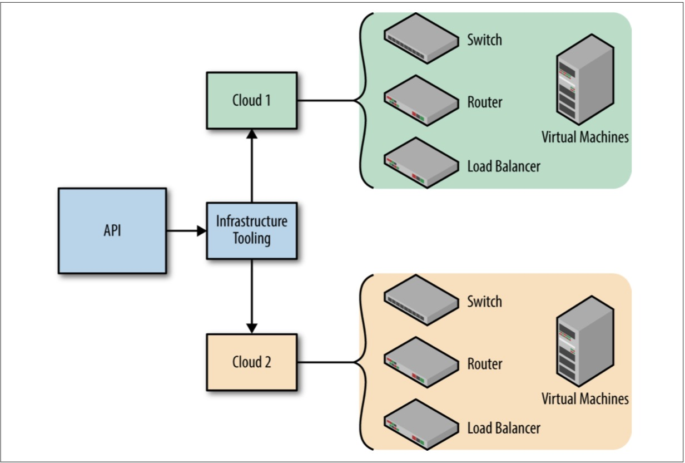
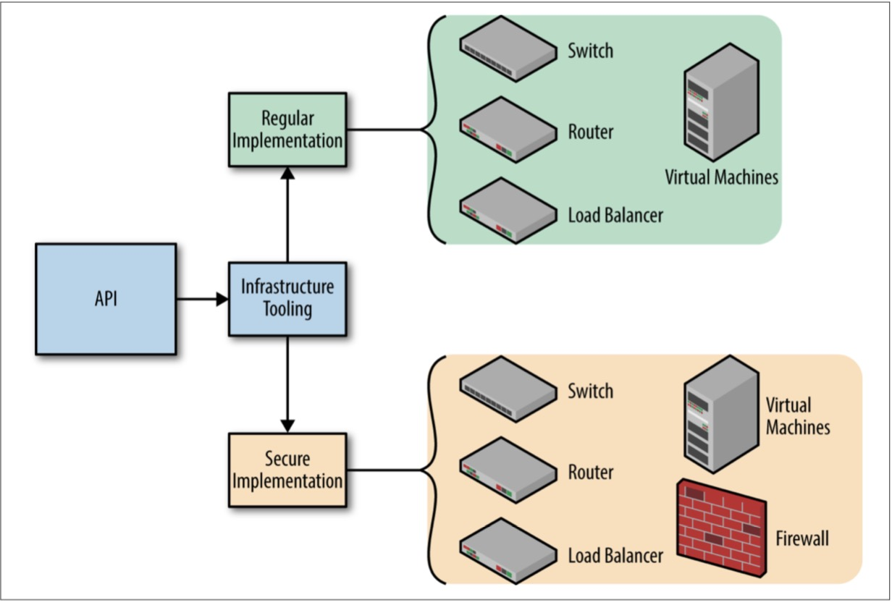

# 第5章 开发基础架构应用程序

在构建应用程序以管理基础架构时，我们要将需要公开的API与要创建的应用程序等量看待。这些API将代表您的基础架构的抽象，而应用程序将使用API消费这些这些基础架构。

务必牢牢掌握两者的重要性，和如何利用它们来创建可扩展的弹性基础架构。

在本章中，我们将举一个虚构的云原生应用程序和API示例，这些应用程序和API会经历正常的应用程序周期。如果您想了解更多有关管理云原生应用程序的信息，请参阅第7章。

## 设计API

>这里的API是指处理数据结构中的基础架构表示，而不关心如何暴露或消费这些API。通常使用HTTP RESTful端点来传递数据结构，API如何实现对本章并不重要。

随着基础架构的不断发展，运行在基础架构之上的应用程序也要随之演变。为这些应用程序的功能将随着时间而改变，因此基础架构是也是隐性地演变。随着基础架构的不断发展，管理它的应用程序也必须发展。

基础架构的功能、需求和发展将永无止境。如果幸运的话，云供应商的API将会保持稳定，不会频繁更改。作为基础架构工程师，我们需要做好准备，以适应这些需求。我们需要准备好发展我们的基础架构和运行其上的应用程序。

我们必须创建可缩放的应用程序，并准备对其进行扩展。为了做到这一点，我们需要了解在不破坏应用程序现有流程的情况下对应用程序进行大量更改的细微差别。

管理基础架构的工程应用的好处在于它解放了运维人员的生产力。

应用程序中使用的抽象现在由工程师来完成。我们可以详尽或抽象的描述API，这都可以。通过具体和抽象定义的强大组合可以帮助运维人员准确地描述他们需要管理基础架构。

## 添加功能

根据功能的性质，向基础架构应用程序添加功能可能非常简单也可能非常复杂。添加功能的目标是能够添加新功能而不会危害现有功能。我们绝不希望引入会以给系统其他组件带来负面影响的功能。此外，我们一直希望确保系统输入在合理的时间内保持有效。

例5-1是本书前面介绍的基础架构API演化的具体示例。我们称之为API v1。

例5-1. v1.json

```json
{
    "virtualMachines": [{
        "name": "my-vm",
        "size": "large",
        "localIp": "10.0.0.111",
        "subnet": "my-subnet"
    }],
    "subnets": [{
        "name": "my-subnet",
        "cidr": "10.0.100.0/24"
    }]
}
```

想象一下，我们希望实现一项功能，允许基础架构运维人员为虚拟机定义DNS记录。新的API看起来略有不同。在例5-2中，我们将定义一个名为version的顶级指令，告诉应用程序这是API的v2版本。我们还将添加一个新的块，用于在虚拟机块的上下文中定义DNS记录。这是v1中不支持的新指令。

例5-2. v2.json

```json
{
    "version": "2",
    "virtualMachines": [{
        "name": "my-vm",
        "size": "large",
        "localIp": "10.0.0.111",
        "subnet": "my-subnet",
        "dnsRecords": [{
            "type": "A",
            "ttl": 60,
            "value": "my-vm.example.com"
        }]
    }],
    "subnets": [{
        "name": "my-subnet",
        "cidr": "10.0.100.0/24"
    }]
}
```

这两个对象都是有效的，应用程序应该继续支持它们。应用程序应检测到v2对象是否打算使用内置于应用程序中的DNS新功能。该应用程序应该足够聪明，以适当地导航到新功能。将资源应用于云时，新的v2对象的资源集将与第一个v1对象相同，但添加了单个DNS资源。

这引入了一个有趣的问题：应用程序应该如何处理旧的API对象？应用程序应仍可以在云中创建资源，且支持无DNS的虚拟机。

随着时间的推移，运维人员可以修改现有虚拟机对象以使用新的DNS功能。应用程序自动检测到增量并为新功能创建DNS记录。

## 弃用功能

让我们快速转到下一个API v3。在这种情况下，我们的API不断发展，我们在表示IP地址方面已陷入僵局。

在API v1中，我们能够通过本地IP指令方便地为网络接口声明一个本地IP地址。我们现在的任务是为虚拟机提供多种网络接口。需要注意的是，这将与最初的API v1冲突。

让我们来看一下示例5-3中新的v3版本的API。

例5-3. v3.json

```json
{
    "version": "2",
    "virtualMachines": [{
        "name": "my-vm",
        "size": "large",
        "networkInterfaces": [{
            "type": "local",
            "ip": "10.0.0.11"
        }],
        "subnet": "my-subnet",
        "dnsRecords": [{
            "type": "A",
            "ttl": 60,
            "value": "my-vm.example.com"
        }]
    }],
    "subnets": [{
        "name": "my-subnet",
        "cidr": "10.0.100.0/24"
    }]
}
```

使用定义多个网络接口所需的新数据结构，我们已弃用本地IP指令。但是我们并没有删除定义IP地址的概念，我们只是简单地重组了它。这意味着我们可以分两个阶段废弃该指令。首先警告，然后是拒绝。

在警告阶段，我们的应用程序可能会输出不再支持本地IP指令的警告。应用程序可以接受在对象中定义的指令，并将旧API v2转换为新API v3。

转换将采用为本地IP定义的值，并在新网络接口指令中创建与初始值相匹配的单个块。应用程序可以继续处理API对象，就好像用户发送了v3对象而不是v2对象一样。预计用户会注意到该指令已被弃用，并及时更新其表示。

在拒绝阶段，应用程序将彻底拒绝v2 API。用户将被迫更新他们的API到更新的版本，或者甘愿在基础架构中冒此风险。

>**弃用是非常危险的**
>
>这是一个极其危险的过程，成功将用户引导到新版本可能会非常困难。拒绝输入必须给出很好的理由。
>
>如果输入信息的会破坏应用程序保障，则应拒绝该信息。否则，最佳实践通常是警告并继续。
>
>破坏用户的输入很容易让运维人员感到不安和沮丧。

基础架构工程师在对API进行版本控制时，必须对在何时弃用哪些功能做出最佳判断。此外，工程师需要花时间给出巧妙的解决方案，这些方案可以是警告或转换。在某些情况下，做到悄无声息的API转换对不断发展的云原生基础架构来说是一个巨大的胜利。

## 基础架构变异

基础架构需要随着时间的推移而变化。这是云原生环境的本质。不仅应用程序频繁部署，而且运行基础架构的云供应商也在不断变化。

基础架构的变化可以有多种形式，比如扩大或缩小基础架构，复制整个环境或消费新资源。

当运维人员承担变更基础架构的任务时，我们可以看到API的真实价值。假设我们想要扩展环境中的虚拟机数量。不需要更改API版本，但对基础架构的表示做一些小的调整将很快反映出变化。就这么简单。

然而，重要的是要记住，在这种情况下，运维可能是一个人，也可能是另一个软件。

请记住，我们故意将API构造成易于被计算机解码。我们可以在API的两端使用该软件！

> **使用Operator消费和生产API**
>
> Operater——构建云原生产品和平台的CoreOS公司创造了这个术语，即Kubernetes控制器，实现了软件取代人类参与管理特定应用的需求。通过协调预期状态和设定预期状态来实现。
>
> CoreOS在他们的博客文章中这样描述Operator：
>
> Operator是特定应用程序的控制器，它代表Kubernetes用户扩展Kubernetes API以创建、配置和管理复杂有状态应用程序的实例。它建立在基本的Kubernetes资源和控制器概念的基础上，但包含一个域或特定于应用程序的知识体系以实现常见任务的自动化。
>
> 该模式规定Operator可以通过给定声明性指令集来更改环境。Operator是工程师应该创建的用于管理其基础架构的云原生应用程序类型的完美示例。

设想一个简单的情景——自动调节器（autoscaler）。假设我们有一个非常简单的软件，可以检查环境中虚拟机上的平均负载。我们可以定义一个规则，只要平均负载平均值高于0.7，我们就需要创建更多的虚拟机来均匀地分配我们的负载。

Operator的规则会随着负载平均值的增加而不再适用，最终Operator需要用另一台虚拟机更新基础架构API。这样可以扩大我们的基础架构，但同样我们也可以很容易的定义另一个规则当平均负载降至0.2以下时缩小虚拟机规模。请注意，Operator这个术语在这里应该是一个应用程序，而不是一个人。

这是自动缩放的一个非常原始的例子，但该模式清楚地表明软件现在可以开始扮演人类运维人员的角色。

有许多工具可以帮助扩展如Kubernetes、Nomad和Mesos等基础架构上的应用程序负载。这假定应用程序层运行一个编排调度器上，它将为我们管理应用程序负载。

想象一下，如果多个基础架构管理应用程序使用相同的API，那么会进一步将基础架构API的价值最大化。这是一个非常强大的基础架构演进模式。

我们来看看相同的API——记住它只有几千字节的数据，并且在两个独立的基础架构管理应用程序运行。图5-1显示了一个示例，两个基础架构应用程序从相同的API获取数据但将基础架构部署到各自独立的云环境。



图5-1. 一个API被部署在两个云中

该模型为基础架构工程师提供了在多个云提供商之间提供通用抽象的强大功能。现在我们可以看到应用程序如何确保 API在多个地方代表相同的基础架构。如果基础架构API负责提供自己的抽象和资源调配，则基础架构不必与单个云提供商的抽象相关联。用户可以在他们选择的云中创建独特的基础架构排列。

## 维护云提供商兼容性

虽然保持API与云提供商的兼容性将会有很多工作要做，但对于部署工作流程和供应流程时，很少需要改变。请记住，人类比技术更难改变。如果您可以保证人类的环境一致，这将抵消所需的技术开销。

您还应该权衡多云兼容性的好处。如果它不是您的基础架构的需求，您可以节省大量的工作。考虑云厂商锁定时请参阅附录B。

我们也可以在同一个云中运行不同的基础架构管理应用程序。这些应用程序可能会对API进行不同的解释，这会导致对于运维人员的意图的定义略有不同。根据运维人员定义的基础架构的意图，在管理应用程序之间进行切换可能只是我们所需要的。图5-2显示了两个应用程序正在读取相同的API源，但在实现数据时会根据环境和需要而不同。



图5-2. 一个API以不同的方式部署在同一个云中

## 结论

与基础架构API相比，基础架构应用的排列组合是无止境的。这为基础架构工程师提供了一个非常灵活和可扩展的解决方案，希望能够以不同的环境和方式掌握基础架构。

我们为满足基础架构要求而可能构建的各种应用程序现在已成为基础架构本身的代表。这是第3章中定义的基础设施即软件的缩影。

请务必记住，我们构建的应用程序本身就是云原生应用程序。这是一个有趣的故事，因为我们正在构建云原生应用程序来管理云原生基础架构。