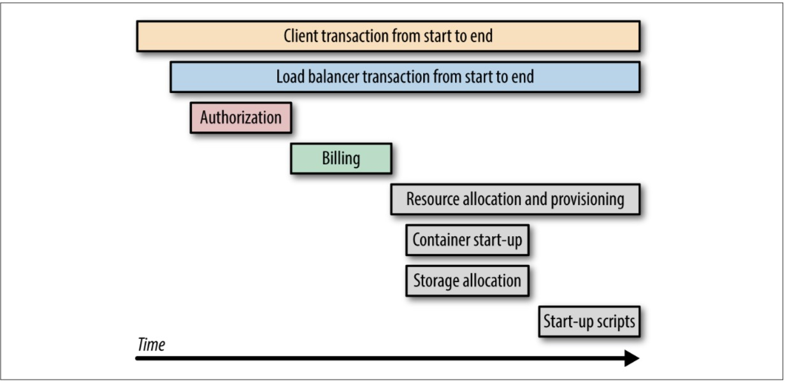

# 第7章 管理云原生应用程序

云原生应用程序依赖基础架构才能运行，反过来说，云原生基础架构也需要云原生应用程序来维持。

对于传统基础架构，维护和升级基本上都是由人工完成。可能是在单机上手动运行服务或使用自动化工具定义基础结构和应用程序的快照。

但是，如果基础架构可以由应用程序管理，同时基础架构又可以管理应用程序，那么基础架构工具就会成为另一种应用程序。工程师对于基础架构的责任可以用调解器模式表示，内置于该基础架构上运行的应用程序中。

我们花了三章来说明如何构建可以管理基础架构的应用程序。本章将介绍如何在基础架构上运行云原生应用或其它任何应用。

如前所述，保持基础架构和应用程序的简单非常重要。解决应用程序复杂性最常用的方法就是把应用程序分解成小的，易于理解的组件。通常通过创建单一职责的服务来实现，或者将代码分解为一系列事件触发的函数。

随着小型、可部署单元的扩容成多份即使是最自动化的基础架构也可能被压垮。管理大量应用程序的唯一方法是让它们承担第1章中所述的功能性操作。应用程序需要在可以按规模管理之前变成原生云。

学习完本章不会帮助您建下一个伟大的应用程序，但您将了解一些基础知识，这块可以让您的应用程序在云原生基础架构是良好运行。

## 应用程序设计

已经有很多教您如何构建应用程序的书了，本书不打算再讨论。但是，了解应用程序架构如何影响基础架构设计仍然很重要。

正如我们在第1章中讨论的那样，我们假设应用程序设计成云原生的，这样可以从云原生基础架构中获得最大收益。云原生的本质是应用程序由软件而不是人类来管理。

应用程序的设计和打包方式是分开考虑的。应用程序可以是云原生的，打包为RPM或DEB文件，可以部署到虚拟机而不是容器。它们可以是单体应用或微服务，可以用Java或Go编写。

这些实现细节不影响应用程序被设计成在云上运行。

假设我们有一个用Go编写的应用程序，使用容器打包，运行在Kubernetes上，视为微服务运行。

我们假想的这个应用是“云原生”的吗？

如果应用程序将所有活动日志记录到文件，还硬编码数据库IP地址呢？也许它不接受运行时配置并将状态存储在本地磁盘上。如果它不以可预见的方式存在或挂起并等待人工调试呢？

这个应用所选择的语言和打包方式，可能会让您觉的它是云原生的，但实际上它根本不是。像Kubernetes这样的框架可以通过各种功能来管理这个应用，但即使它可以运行，但还是需要人类来维护。

第1章详细介绍了使应用程序在云原生基础架构上运行得更好的一些特点。如果我们具有第1章中规定的特点，应用程序还有另一个考虑因素：我们如何有效地管理它们？

## 实施云原生模式

诸如弹性伸缩、服务发现、配置、日志、健康检查和相关监控指标等功能都可以以不同方式在应用程序中实现。实现这些功能的常见做法是通过导入实现相关功能的标准语言库。Netflix OSS和Twitter的Finagle是在Java语言库中实现这些功能的很好的例子。

应用程序可以导入和使用库，自动获得库中提供许多相关的功能，无需额外的代码。当一个组织内支持的语言很少时，这种模式很有意义。这种模式很容易实现最佳实践。

当组织开始实施微服务时，它们往往倾向于使用多语言服务。这样可以自由地为不同的服务选择正确的语言，但是很难为每种语言维护库。

获得该功能的另一种方法是通过所谓的"Sidecar"模式。此模式应用程序本身与实现管理功能的应用程序绑定在一起。通常作为单独的容器来实现，但也可以通过在虚拟机上运行另一个守护进程来实现。

Sidecar的例子包括以下内容：

**Envoy代理**

为服务增加弹性伸缩和监控指标

**注册**

通过外部服务发现注册服务

**动态配置**

订阅配置更改并通知服务进程重新加载

**健康检查**

提供用于检查应用程序运行状况的HTTP端点(Endpoints)

Sidecar容器还可以用来适配Polyglot容器，通过暴露特定于语言的端点与使用库的应用程序进行交互。来自Netflix的Prana正是为那些不使用标准Java库的应用程序而定制的。

当有团队集中管理特定的Sidecar进程时，Sidecar模式很有意义。如果工程师想要在它们的服务中暴露监控指标，它们可以将其构建到应用程序中，或者一个单独的团队也可以提供处理日志记录输出并公开计算出的监控指标的Sidecar应用。

在这两种情况下，都可以在不修改应用程序的情况下为应用添加功能。在可以使用软件管理应用程序后，我们来看看如何管理应用程序的生命周期。

## 应用程序生命周期

云原生应用程序除了生命周期应该由软件管理以外，其生命周期本身与传统应用程序并没有什么不同。

本章不打算解释管理应用程序时涉及的所有模式和选项。我们将简要讨论几个阶段，在云原生基础架构之上运行云原生应用，这几个阶段受益程度最高：部署、运行和下线。

这些主题并不都包含所有选项，但还有很多其他书籍和文章可供参考，这取决于应用程序的架构，语言和所选库。

### 部署

部署是应用程序最依赖基础架构的一个领域。虽然没有什么东西会阻止应用程序自行部署，但基础架构管理还可以管理更多的方面。

本文不会涉及集成和交付，但是在这个领域的一些做法很明确。应用程序部署不仅仅是获取和运行代码。

云原生应用程序旨在由软件管理应用生命周期的各个阶段。这包括周期性的健康检查和部署初始化。应尽可能地消除技术、流程和策略中人为造成的瓶颈。

应用程序的部署首先应该是自动、自助的，如果应用正在活跃开发中，则应该是被频繁触发的。也应该可以被测试、验证可稳定运行。

新版本和新功能的发布时很少会有一次性替换应用程序的所有实例的情况。新功能在配置标志成"gated"，可以在不重启应用的情况下选择性地动态启用新功能。版本升级部分发布，通过测试进行验证，并在所有测试通过时以受控方式发布。

当启用新功能或部署新版本时，应该存在控制流向或隔离应用流量的机制（请参阅附录A）。通过缓慢的部署和更快的应用性能反馈循环进行新功能的试用，可以限制中断带来的影响。

基础架构应负责部署软件的所有细节。工程师可以定义应用程序版本，基础架构要求和依赖关系，并且基础架构将朝着该状态发展，直至满足所有要求或需求更改。

### 运行

运行应用程序应该是应用程序生命周期中最平稳最稳定的阶段。运行软件最重要的两个的方面在第1章中讨论：了解应用程序在做什么以及可操作性即可以根据需要更改应用程序。

我们已经在第1章中详细介绍了关于应用报告健康和遥测数据的可观察性，但是当事情不按预期工作时，你会做什么？如果应用程序的遥测数据显示它不符合SLO，那么如何解决和调试应用程序？

对于云原生应用程序，你不应该通过SSH连接到服务器的形式查看日志。如果你需要SSH，更应该考虑使用日志或其它的服务替代。

你仍然需要访问应用程序（API）和日志数据（云日志记录）以及获取在堆栈中的服务，但这值得通过演练来查看是否需要传统工具。当事件中断时，你需要一个调试应用程序和基础架构组件的方法。

在做系统调试时，你应该首先查看你的基础架构测试，如第5章所述。测试应公开所有未正确配置或未提供预期性能的基础架构组件。

不能说因为你不管理底层基础架构就意味着基础架构不可能出问题。通过测试来验证期望值将确保你的基础架构能够以你期望的方式运行。

在排除基础架构后，你应该查看应用程序以获取更多信息。应用程序调试的最佳位置是应用性能管理（APM）以及可能通过OpenTracing等标准进行的分布式应用程序跟踪。

OpenTracing示例、实现和APM不在本书的范围之内。总而言之，OpenTracing允许你在整个应用程序中跟踪调用，以更轻松地识别网络和应用程序通信问题。OpenTracing的示例可视化可以在图7-1中看到。APM为你的应用程序添加了用于向收集服务报告指标和故障的工具。

图7-1. OpenTracing可视化

当测试和跟踪仍然没有暴露出问题时，有时你只需要在应用程序上启用更详细的日志记录。但是，如何在不破坏问题的情况下启用调试？

运行时配置对于应用程序很重要，但在云原生环境中，无须重启应用程序，配置就应该是动态的。配置选项仍然通过应用程序中的库实现，但标志值应该能够通过集中协调器，应用程序API调用，HTTP协议Header或多种方式进行动态更改。

Netflix的Archaius和Facebook的GateKeeper是动态配置的两个例子。前Facebook工程师经理Justin Mitchell在Quora的帖子中分享到：

> GateKeeper是从代码部署中解耦出来的功能。我们可以在几天或几周内发布新功能，因为我们观察了用户指标、性能并确保服务可以随时扩展。

允许对应用程序配置进行动态控制，可以实现更多对曝光过度的新功能的控制并更好地测试已部署代码的覆盖范围。可以很容易的发布新代码并不意味着这是适合所有情况的正确解决方案。

基础架构可以帮助解决此问题，并通过协调何时启用新功能和基于高级网络策略的路由控制来启用更灵活的应用程序。这种模式还允许更细粒度的控制和更好的协调发布或回滚场景。

在动态的自助服务环境中，部署的应用程序数量将快速增长。你需要确保有一个简单的方法来动态调试应用类似自助服务模型中部署的应用。

工程师喜欢发布新应用程序一样，反过来很难让它们下线旧应用程序。即使如此，旧应用下线仍然是应用程序生命周期中的关键阶段。

### 下线

部署新的应用程序和服务在快速迭代的环境中很常见。下线应用程序应该像创建应用一样自动化。

如果新的服务和资源被自动化部署与监控，则它们应该按照相同标准下线。尽快部署新服务而不删除未使用的服务是应对技术债务的最简单方法。

识别应该下线的服务和资源，这是一个特定的业务。你可以使用应用程序遥测的经验数据来了解某个应用程序是否正在被使用，但是下线应用程序的决定应由该业务决定。

基础架构组件（例如，VM实例和负载均衡器端点）应在不需要时被自动清理。自动化组件清理的一个例子是Netflix的Janitor Monkey。该公司在一篇博文中解释道：

>Janitor Monkey通过应用一组规则来决定资源是否应该成为候选的清理内容。如果任何规则确定该资源是被清理的候选内容，则Janitor Monkey标记该资源并安排清理时间。

所有这些应用阶段的目标是让基础架构和软件来管理原本由人类管理的方面。我们采用协调模式与组件元数据相结合的方式来不断运行，并根据当前上下文对需要采取的高层次操作做出决策。以此来取代由人类编写的临时自动化脚本。

应用程序的生命周期不是唯一一个需要依赖于基础架构的阶段。还有一些每个阶段都要依赖于基础架构服务的程序。我们将在下一节讨论一些提供给这类应用的支持服务和基础架构API。

## 对运行于基础架构上的应用的要求

云原生应用程序对基础架构的期望不仅只是执行二进制文件，它们还需要抽象、隔离与保证应用程序运行和管理。对于应用程序来说，需要提供hook和API以允许基础架构管理它们。为了实现这种模式，两者就需要有一种共生关系。

我们在第1章中定义了云原生应用程序，并刚刚讨论了一些生命周期的要求。现在让我们看看云原生应用程序对从运行它们的基础架构建设的更多期望：

 - 运行与隔离
 - 资源分配和调度
 - 环境隔离
 - 服务发现
 - 状态管理
 - 监控和记录
 - 监控指标聚合
 - 调试和跟踪

所有这些期望都应该是服务的默认选项，或者是由自助API提供。我们将更详细地解释每个要求，以确保这些期望被明确的定义。

### 应用程序运行和隔离

除了有时候需要的解释器，传统应用程序只需要一个内核就可以运行。 云原生应用仍然需要它们，但云原生应用运行时同样也需要与操作系统和其他应用程序隔离。隔离使多个应用能够在同一台服务器上运行并控制它们的依赖和资源。

应用隔离有时被称为多租户。该术语可用于在同一服务器上运行的多个应用程序以及在共享集群中运行应用程序的多个用户。用户可以运行经过验证的可信代码，也可以运行你不能控制且不信任的代码。

云原生不意味着需要使用容器。Netflix率先推出了许多云原生模式，当他们从原来的方式过渡到在公有云上运行时，使用虚拟机作为它们的部署工具，而不是容器。FaaS服务（例如AWS Lambda）是用于打包和部署代码的另一种流行的云原生技术。在大多数情况下，它们使用容器进行应用程序隔离，但容器包装对用户是不可见的。

> **什么是容器？**
>
>容器有很多不同的实现。Docker推广了术语“容器”来描述一种在隔离的环境中打包和运行应用程序的方式。基本上，容器使用内核原语或硬件功能来隔离单个操作系统上的进程。
>
>容器隔离级别可能会有所不同，但通常这意味着应用程序使用独立的根文件系统、命名空间以及来自同一服务器上其他进程的资源分配（例如，CPU和RAM）运行。容器格式已被许多项目采用，并创建了开放容器计划（OCI），该计划定义了如何打包和运行应用程序容器的标准。

容器隔离还会给编写应用程序的工程师造成负担。它们现在负责声明所有的软件依赖关系。如果它们没做到这点，应用程序将无法运行，因为必要的库将不可用。

容器经常被选中来用于云原生应用程序，因为已经出现了更好的用于管理它们流程和编排的工具。虽然容器是实现运行时和资源隔离的最简单方式，但这并不总是（并且也可能不会）如此。

### 资源分配和调度

从历史上看，应用程序可以提供最低系统要求的粗略估计，人类有责任确定应用程序在满足什么需求下可以运行。人工调度可能需要很长时间才能准备好应用程序运行的操作系统和依赖项。

部署可以通过配置管理实现自动化，但在运行应用程序时，仍然需要人员验证资源并标记服务器。云原生基础架构基于依赖隔离，允许应用程序在任何有资源的地方运行。

通过隔离，只要系统有可用的进程，存储和可访问的依赖，应用程序就可以在任何地方被调度。动态调度通过将决策留给机器更好地消除了人为瓶颈。集群调度程序从所有系统收集资源信息并计算出应用程序的最佳位置。

>人为控制应用程序不能很好的伸缩。当人生病、休假（或至少它们应该），通常会带来瓶颈。随着规模和复杂性的增加，人们也不可能清楚地记住应用程序在哪里运行。
>
>许多公司试图通过招聘更多人来扩大规模。这加剧了系统的复杂性，因为调度需要在多个人之间进行协调。最终，人为调度将采用电子表格（或类似的解决方案）来保存每个应用程序的运行位置。

动态调度并不意味着运维人员无法控制。基于调度器可能没有的知识，运维人员仍然可以覆盖或强制进行调度决策。覆盖和手动资源调度应通过API提供，而不是会议请求。

解决这些问题是Google编写名为Borg的内部集群调度程序的主要原因之一。在Borg的研究报告中，谷歌指出Borg提供了三大好处：

1. 它隐藏了资源管理和失败处理的细节，因此用户可以专注于应用程序开发；
1. 以非常高的可靠性和可用性运行，并支持相同的应用程序；
1. 让我们可以有效地在数以万计的机器上运行工作负载。

调度程序在任何云原生环境中的角色都非常相似。从根本上说，它需要抽象出许多机器并允许用户而不是服务器请求资源。

### 环境隔离

当应用程序由许多服务组成时，基础架构就需要提供一种方法来定义所有依赖的隔离。传统的方法是通过将复杂的服务器，网络或集群隔离成开发或测试环境来管理依赖关系。基础架构应能够通过应用程序环境在逻辑上分离依赖关系，而不会完全复制集群。

逻辑分割环境可以更好地利用硬件，减少重复的自动化，并且更容易测试应用程序。在某些情况下，需要单独的测试环境（例如，需要进行底层更改时）。但是，应用程序测试应该在完全复制的基础架构下进行。

环境可以是传统的永久性开发、测试、预发和生产，也可以是动态分支或基于提交（commit）。它们甚至可以是生产环境的一部分，通过动态配置和实例的选择性路由启用功能。

环境应有应用程序所需的所有数据，服务和网络资源组成。这包括诸如数据库，文件共享和任何外部服务之类的东西。云原生基础架构可以创建低开销的环境。

基础架构应该能够提供环境和被使用。应用程序应遵循最佳实践，允许灵活配置以支持环境，并通过服务发现发现支持服务的端点。

### 服务发现

应用程序几乎可以肯定依靠一项或多项服务来提供商业利益。基础架构的责任是提供一种服务在每个环境基础上找到彼此的方式。

某些服务发现需要应用程序进行API调用，而其他服务则通过DNS或网络代理公开透明地进行。使用什么工具并不重要，但服务使用服务发现很重要。

尽管服务发现是最古老的网络服务之一（即ARP和DNS），但它经常被忽视不用。在每个实例文本文件或代码中静态定义服务端点是不可扩展的，且不适合云原生环境。端点（Endpoint）注册应该在创建服务时自动发生，并且端点可用或消失。

云原生应用程序与基础架构一起工作以发现其相关服务。这些包括但不限于DNS，云元数据服务或独立服务发现工具（即etcd和consul）。

### 状态管理

如果有状态管理的话基础架构将能知道应用程序实例需要做什么。这与应用程序生命周期截然不同，因为生命周期适用于应用程序的整个开发过程。状态适用于启动和停止的实例。

应用程序有责任提供API或hook，以便检查其当前状态。基础架构的责任是监控实例的当前状态并采取相应的行动。

以下是一些应用程序状态：

 - 已提交
 - 预定
 - 准备好了
 - 健康
 - 不健康
 - 终止

这些状态和相应行动的简要概述如下：

1. 一个应用申请提交运行。
2. 基础架构检查请求的资源并安排应用程序。应用程序启动时，提供一个准备好/未准备好的状态。
3. 基础架构将等待就绪状态，然后允许使用应用程序资源（例如，将实例添加到负载均衡器）。如果应用程序在指定的时间前未准备就绪，基础结构将终止它并安排一个新的应用程序实例。
4. 一旦应用程序准备就绪，基础架构将监控活动状态并等待不健康状态，或者直到应用程序设置为不再运行。

还有比上述更多的状态。如果要对状态进行正确的检查和采取行动，则状态需要得到基础架构的支持。Kubernetes通过事件、探针和hook实现应用程序状态管理，但是每个编排平台都应该具有类似的应用程序管理功能。

当应用程序被提交、调度或扩缩容时，会触发Kubernetes事件。探针用于检查应用程序何时准备好提供流量（就绪）并确保应用程序健康（存活）。Hook用于在进程启动之前或之后需要发生的事件。

应用程序实例的状态与应用程序生命周期管理同样重要。基础架构在确保实例可用并据此采取行动方面起着关键作用。

### 监控和记录

永远不要让应用程序自己要求监控或被日志记录；它们是基础架构运行的基本条件。更重要的是，如果需要被监控和记录，其配置应该以应用程序资源请求相同的方式声明为代码。如果你拥有部署应用程序的所有自动化功能，但无法动态监控服务，那么云原生基础架构也就不完整。

状态管理（即进程健康检查）和日志记录处理应用程序的各个实例。日志系统应该能够根据应用程序、环境、标签或任何其他有用的元数据整合日志。

应用程序应该尽可能没有单点故障，并且应该运行多个实例。如果一个应用程序有100个实例正在运行，就算单个实例变得不健康，监控系统也不应触发警报。

监控从整体上看应用程序，并用于调试和验证所需的状态监控与警报不同，因为应根据应用程序的度量和SLO触发警报。

### 指标聚合

要知道应用程序处于健康状态时的行为方式，收集指标。它们还可以提供有关不健康时可能被破坏的信息的洞察，并且就像监控一样，收集的指标应作为代码与应用程序定义的一部分被请求。

基础架构可以自动收集有关资源利用率的指标，但应用程序有责任呈现服务级别指标。

监测和日志记录是对应用程序运行时的状况检查，指标可提供所需的遥测数据。没有指标（metric），就无法知道应用程序是否满足服务级别目标以提供商业价值。

>从日志中提取遥测和健康检查数据可能很诱人，但要小心，因为日志记录需要后处理，并且比应用特定监控指标来说开销更重。
>
>在收集指标时，你希望尽可能接近实时数据。这需要一个可扩展且简单高效的解决方案。
>
>应该使用日志进行调试，且应该预计到数据处理的延迟。

与日志记录类似，指标通常在实例级别收集，然后汇总在一起以提供完整的服务视图，而不是单个实例的展示。

一旦应用程序提供收集指标的方法，基础架构的工作就是搜集、整合和存储指标用于分析。收集指标的端点应该可以根据每个应用程序进行配置，但数据格式应该标准化，以便可以在单个系统中查看所有指标。

### 调试和跟踪

应用程序在开发过程中很容易调试。集成开发环境（IDE），代码断点以及在调试模式下运行都是工程师在编写代码时可以使用的所有工具。

对于部署的应用程序来说，自检要困难得多。当应用程序由数十或数百个微服务或独立部署的功能组成时，此问题更为严重。当用多种语言和不同的团队编写服务时，也可能无法将工具内置到应用程序中。

基础架构需要提供调试整个应用程序的方法，不仅仅是单个服务。调试有时可以通过日志记录系统完成，但是复现错误需要较短的反馈回路。

如前所述，调试对于动态配置来说是很好用的。当发现问题时，应用程序可以切换到详细日志记录，而无需重新启动，并且流量可以通过应用程序代理有选择地路由到实例。

如果问题无法通过日志输出解决，那么分布式跟踪提供了一个不同的界面来可视化发生的事情。分布式跟踪系统（如OpenTracing）可以补充日志以帮助人类调试问题。

跟踪为调试分布式系统提供了更短的反馈回路。如果它不能构建到应用程序中，则可以通过代理或流量分析由基础架构透明地完成。当你大规模地运行任何协调的应用程序时，基础架构提供了一种调试应用程序的方法。

尽管在分布式系统中设置跟踪有很多好处和实现细节，但我们不会在此讨论。应用程序跟踪一直非常重要，并且在分布式系统中越来越困难。云原生基础架构需要提供可以以透明方式跨越多个服务的跟踪服务。

## 结论

应用程序需求已经改变：带有操作系统和软件包管理器的服务器已经不够用了。应用程序现在需要协调服务和更高级别的抽象。抽象允许资源与服务器分离并根据需求以编程的方式使用。

本章中提出的要求并不是基础架构可以提供的所有服务，但它们是云原生应用程序所期望的基础。如果基础架构不提供这些服务，那么应用程序将不得不实施它们，否则它们将无法达到现代业务所需的规模和速度。

基础架构不会自行发展：人们需要改变自己的行为方式，从根本上解决以不同的方式运行应用程序这个问题。幸运的是，有些项目已经在借鉴开创了这些解决方案的公司的经验了。

应用程序依赖基础架构的功能和服务来支持敏捷开发。基础架构要求应用程序公开端点和集成以自主管理的方式。工程师应尽可能使用现有的工具，并设计出有弹性的简单解决方案。
